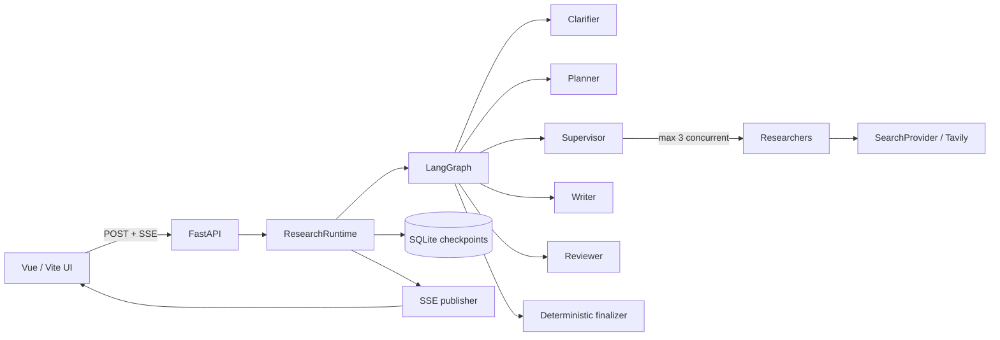

# Enhanced Deep Research

An evidence-first research agent for portfolio-scale, long-running web research. It turns one question into a bounded LangGraph workflow, exposes useful progress through Server-Sent Events (SSE), and renders citations from validated `EvidenceItem` identifiers instead of asking a model to invent reference markup.

The MVP is intentionally narrow: one local or single-instance service, one search provider, SQLite checkpoints, and explicit limits on every adaptive loop.

## Architecture



The deployment boundary is a single FastAPI instance. SQLite owns checkpoints and lightweight run metadata; the in-process publisher owns live SSE subscribers.

| Area | Responsibility |
| --- | --- |
| `backend/src/deep_research/domain` | Validated tasks, sources, evidence, reviews, errors, and events |
| `backend/src/deep_research/graph` | Top-level and nested LangGraph construction plus bounded routing |
| `backend/src/deep_research/nodes` | Clarification, planning, research, gap checks, writing, review, and finalization |
| `backend/src/deep_research/services` | Runtime, cancellation, citations, event streaming, retries, and evidence access |
| `backend/src/deep_research/security` | Canonical URL policy, resolved-IP checks, and payload redaction |
| `backend/evals` | Versioned 15-case dataset and deterministic offline metrics |
| `frontend/src` | Typed SSE client, state projection, recovery, and workflow UI |

## Evidence and bounded adaptation

Search results are normalized into two linked records:

- `Source` stores canonical URL, title, domain, retrieval time, content hash, and source type.
- `EvidenceItem` stores a claim, short excerpt, context, relevance, task ID, source ID, and discovery round.

Raw pages are provider inputs only; they are not top-level graph state, checkpoints, SSE payloads, or final reports. Writer prompts receive structured evidence packets. The finalizer validates every cited Evidence ID against its task and source, then assigns reference numbers by first appearance and renders Markdown deterministically.

Server-owned limits are enforced in code:

- 3–5 initial tasks; at most 2 Supervisor tasks and 1 Reviewer task
- at most 2 rounds per task and 2 queries per round
- at most 3 Researchers concurrently and 20 total search queries
- one global coverage assessment and one Reviewer repair action
- at most 8 Sources and 20 EvidenceItems per task

A failed task does not erase successful siblings. Partial evidence produces a named limitation; zero valid evidence fails without generating a report.

## Observable workflow

The streaming endpoint emits typed envelopes without prompts, raw pages, credentials, or hidden reasoning:

```json
{
  "type": "search_completed",
  "run_id": "run-id",
  "thread_id": "thread-id",
  "sequence": 7,
  "timestamp": "2026-08-26T12:00:00Z",
  "payload": {
    "task_id": "task-1",
    "round": 1,
    "query_count": 1,
    "result_count": 3,
    "status": "completed"
  }
}
```

The API supports start, one clarification/resume on the same thread, snapshot restoration, report retrieval, and cancellation under `/api/v1/research`. SSE history replay is not supported; refresh recovery uses the latest committed snapshot rather than replaying past events.

## Local setup

Requirements: Python 3.11+, Node.js 20+, npm, an OpenAI-compatible model endpoint, and a Tavily API key for live application runs.

From PowerShell:

```powershell
cd backend
python -m venv .venv
.\.venv\Scripts\python.exe -m pip install -e ".[dev]"
Copy-Item ..\.env.example .env
# Fill LLM_API_KEY and TAVILY_API_KEY in .env
.\.venv\Scripts\python.exe -m uvicorn deep_research.api.main:app --reload
```

In a second terminal:

```powershell
cd frontend
npm ci --cache ..\.npm-cache
npm run dev
```

The frontend calls `/api/v1/research` on its own origin. The Vite development server proxies `/api` to `http://127.0.0.1:8000`, so the two commands above connect directly during local development. The frontend build and tests do not require providers.

## Configuration

`.env.example` lists provider settings, the SQLite path, an explicit CORS allowlist, and every server-owned budget. The default hard cap is `MAX_TOTAL_SEARCH_QUERIES=20`; clients cannot raise it in a request. Never commit `.env` or provider credentials.

## Verification

Default verification is fully offline and uses scripted model/search providers:

```powershell
cd backend
.\.venv\Scripts\python.exe -m pytest tests/unit tests/integration tests/acceptance -q
.\.venv\Scripts\python.exe -m ruff check src tests evals
```

The equivalent tool-independent commands are `pytest tests/unit tests/integration tests/acceptance -q` and `ruff check src tests evals`.

```powershell
cd frontend
npm run test:run
npm run build
```

## Reproducible evaluation

The fixed JSON Lines dataset covers 15 technical comparisons, ambiguous inputs, conflicting claims, security, and weak-evidence cases. The current fake runner is a deterministic synthetic metric smoke test: it checks stable dataset/CLI/metric contracts without executing the production graph or measuring provider quality. It reports coverage, task overlap, citation validity, grounding, source diversity, budget, latency, recovery, and transparency fields without network access:

```powershell
cd backend
.\.venv\Scripts\python.exe -m evals.run --mode fake --output "$env:TEMP/deep-research-eval.json"
```

The equivalent command starts with `python -m evals.run --mode fake`. Its output records only scripted configuration names, never credentials.

Live evaluation incurs provider cost and is never run by default. The CLI requires an explicit `--live` or `--mode live` request and currently stops unless an application-supplied live runner is provided; this repository does not pretend that offline scores are live-provider results.

## Screenshots

No screenshots are checked in because fabricated or stale images would be misleading. Run the frontend locally to inspect the current responsive workflow, evidence, review, and report views.

## Known limitations and non-goals

- SQLite plus an in-process event publisher does not support horizontal scaling, multiple API workers, or durable event replay.
- Tavily is the only implemented search provider. A general crawler and redirect-aware page-fetch client are outside this MVP.
- Live providers determine real-world latency and retrieval quality; fake evaluation measures reproducible contracts, not provider quality.
- Supervisor/Reviewer adaptive task IDs and parent links still need collision and ancestry hardening before accepting less constrained model outputs.
- Provider-wide retry/timeout wiring and a strict raw-content character cap remain future hardening; the existing helpers are not yet applied across every live boundary.
- User accounts, authorization, multi-tenancy, vector memory, file/PDF upload, academic-specific retrieval, cloud deployment, and automatic publishing are not implemented.

## What I redesigned

The first reference project contributed the value of explicit, stateful LangGraph orchestration; the second contributed observable task execution, SSE progress, and a user-facing workflow. I did not present either codebase's original work as mine. The redesign is the boundary between them: normalized Source/EvidenceItem state, deterministic citation rendering, reservation-based global budgets under parallel execution, bounded clarification/coverage/review loops, cooperative cancellation, sanitized degradation, SQLite recovery, and an offline acceptance/evaluation layer that proves those contracts.
