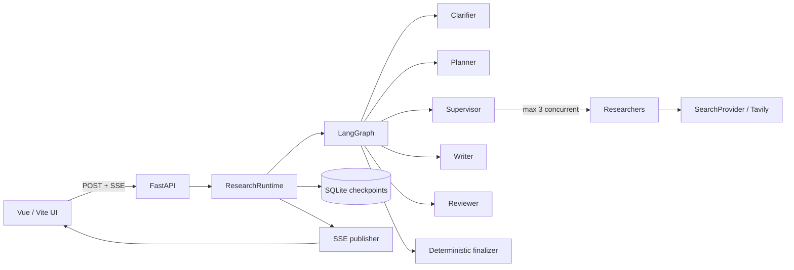
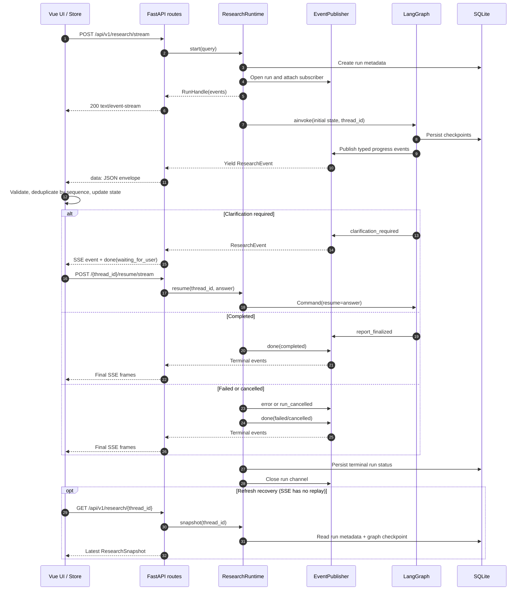

# Enhanced Deep Research

An evidence-first research agent for portfolio-scale, long-running web research. It turns one question into a bounded LangGraph workflow, exposes useful progress through Server-Sent Events (SSE), and renders citations from validated `EvidenceItem` identifiers instead of asking a model to invent reference markup.

The MVP is intentionally narrow: one local or single-instance service, one search provider, SQLite checkpoints, and explicit limits on every adaptive loop.

## Architecture



The deployment boundary is a single FastAPI instance. SQLite owns checkpoints and lightweight run metadata; the in-process publisher owns live SSE subscribers.

| Area | Responsibility |
| --- | --- |
| `backend/src/deep_research/domain` | Validated tasks, sources, evidence, reviews, errors, and events |
| `backend/src/deep_research/graph` | Top-level and nested LangGraph construction plus bounded routing |
| `backend/src/deep_research/nodes` | Clarification, planning, research, gap checks, writing, review, and finalization |
| `backend/src/deep_research/services` | Runtime, cancellation, citations, event streaming, retries, and evidence access |
| `backend/src/deep_research/security` | Canonical URL policy, resolved-IP checks, and payload redaction |
| `backend/evals` | Versioned 15-case dataset and deterministic offline metrics |
| `frontend/src` | Typed SSE client, state projection, recovery, and workflow UI |

## Evidence and bounded adaptation

Search results are normalized into two linked records:

- `Source` stores canonical URL, title, domain, retrieval time, content hash, and source type.
- `EvidenceItem` stores a claim, short excerpt, context, relevance, task ID, source ID, and discovery round.

Raw pages are provider inputs only; they are not top-level graph state, checkpoints, SSE payloads, or final reports. Writer prompts receive structured evidence packets. The finalizer validates every cited Evidence ID against its task and source, then assigns reference numbers by first appearance and renders Markdown deterministically.

Server-owned limits are enforced in code:

- 3–5 initial tasks; at most 2 Supervisor tasks and 1 Reviewer task
- at most 2 rounds per task and 2 queries per round
- at most 3 Researchers concurrently and 20 total search queries
- one global coverage assessment and one Reviewer repair action
- at most 8 Sources and 20 EvidenceItems per task

A failed task does not erase successful siblings. Partial evidence produces a named limitation; zero valid evidence fails without generating a report.

## Observable workflow

The streaming endpoint emits typed envelopes without prompts, raw pages, credentials, or hidden reasoning:



Each run has one in-process subscriber and a bounded event queue. Events carry a monotonic `sequence`; the frontend validates their shape, ignores stale duplicates, and projects them into UI state. The live stream closes after `done`, while refresh recovery reads the latest committed snapshot instead of replaying SSE history.

```json
{
  "type": "search_completed",
  "run_id": "run-id",
  "thread_id": "thread-id",
  "sequence": 7,
  "timestamp": "2026-08-26T12:00:00Z",
  "payload": {
    "task_id": "task-1",
    "round": 1,
    "query_count": 1,
    "result_count": 3,
    "status": "completed"
  }
}
```

The API supports start, one clarification/resume on the same thread, snapshot restoration, report retrieval, and cancellation under `/api/v1/research`. SSE history replay is not supported; refresh recovery uses the latest committed snapshot rather than replaying past events.

## Research memory

Completed runs with a final report are saved to the same SQLite database as the
LangGraph checkpoints. An archive contains the final Markdown, structured draft,
brief, sources, short evidence excerpts, and evidence-linked conclusion cards.
Limitations and unresolved questions are separate cards. The archive write is
transactional and idempotent by thread and report hash.

A new run searches up to three older studies and five cards after the research
brief is ready. The planner receives brief historical leads; the writer and
citation validator continue to use only evidence collected in the current run.
Set `use_memory: false` in `POST /api/v1/research/stream` to skip recall while
still saving the finished study. The frontend offers the same switch.

- `GET /api/v1/memories/researches?limit=20&offset=0`: paged history, newest first.
- `GET /api/v1/memories/researches/{thread_id}`: archived report, sources,
  evidence, cards, and limitations.
- `GET /api/v1/memories/search?q=...`: topic and card search. FTS5 handles
  longer terms; short Chinese terms use ordinary matching.

The `memory_saved` and `memory_save_failed` SSE events report persistence
separately from research completion. A failed archive does not discard the
report. If historical lookup fails, the current research continues and shows a
warning. At startup, completed runs without a saved archive are retried from
their checkpoints. Checkpoints remain on the existing retention policy; archive
deletion, card expiry, and checkpoint cleanup are later-phase work. The current
memory store is local and single-user.

## Literature RAG

The optional literature library parses PDF, DOCX, Markdown, HTML, and text files with Docling, keeps headings, pages, content type, neighbors, and supplied bibliographic metadata in each searchable unit, and stores one vector plus the complete unit payload in Qdrant. It does not add RAG tables to SQLite.

Install the RAG dependencies and start a pinned Qdrant instance:

```powershell
cd backend
python -m pip install -e ".[dev,rag]"
docker run --name deep-research-qdrant -p 6333:6333 -p 6334:6334 -v qdrant_storage:/qdrant/storage qdrant/qdrant:v1.12.5
```

Set `RAG_ENABLED=true` in `backend/.env`. Qdrant Cloud is the recommended default: set `QDRANT_URL`, `QDRANT_API_KEY`, and `EMBED_MODEL_TYPE=dashscope`, then set `EMBED_API_KEY`. For local mode, set `QDRANT_URL=http://localhost:6333` and `EMBED_MODEL_TYPE=local`. The cloud embedding service does not download an embedding model; Docling's tokenizer and the reranker remain local. `QDRANT_VECTOR_SIZE` must match the chosen embedding dimension: use `1024`, `768`, `512`, `256`, `128`, or `64` for DashScope `text-embedding-v3`, and `384` for the default local MiniLM model. Upload processing is synchronous: a failed request writes no successful import record and must be submitted again.

The frontend Literature library panel uses these endpoints:

- `POST /api/v1/literature/documents`: multipart file plus optional `metadata_json`.
- `POST /api/v1/literature/search`: semantic retrieval, reranking, and neighboring context.
- `POST /api/v1/literature/answer`: grounded answer with validated unit citations.
- `DELETE /api/v1/literature/documents/{document_id}`: delete all units for a document.

Example search:

```powershell
Invoke-RestMethod http://127.0.0.1:8000/api/v1/literature/search `
  -Method Post -ContentType 'application/json' `
  -Body '{"query":"hybrid retrieval","limit":5}'
```

Set `use_literature: true` on `POST /api/v1/research/stream`, or select the corresponding frontend option, to search indexed documents during the current research. The Writer can cite only literature units retrieved and revalidated in that run. MQE and HyDE text is used only as a retrieval key.
## Local setup

Requirements: Python 3.11+, Node.js 20+, npm, an OpenAI-compatible model endpoint, and a Tavily API key for live application runs.

From PowerShell:

```powershell
cd backend
python -m venv .venv
.\.venv\Scripts\python.exe -m pip install -e ".[dev,rag]"
Copy-Item ..\.env.example .env
# Fill LLM_API_KEY and TAVILY_API_KEY in .env
.\.venv\Scripts\python.exe -m uvicorn deep_research.api.main:app --reload
```

In a second terminal:

```powershell
cd frontend
npm ci --cache ..\.npm-cache
npm run dev
```

On the first browser visit, create the single owner account; later visits require that username and password.

The frontend calls `/api/v1/research` on its own origin. The Vite development server proxies `/api` to `http://127.0.0.1:8000`, so the two commands above connect directly during local development. The frontend build and tests do not require providers.

## Configuration

`.env.example` lists provider settings, the SQLite path, an explicit CORS allowlist, and every server-owned budget. The default hard cap is `MAX_TOTAL_SEARCH_QUERIES=20`; clients cannot raise it in a request. Never commit `.env` or provider credentials.

## Authentication and production deployment

After the backend health check succeeds, the frontend opens one of three screens: first-owner setup, login, or the authenticated research workspace. The first successful registration closes registration. Sessions use an HttpOnly Cookie; unsafe requests also carry an in-memory CSRF token. Use `python -m deep_research.auth reset-password` from the backend environment to replace the owner password and revoke existing sessions.

For a public HTTPS link and desktop-installable PWA, follow [docs/deployment.md](docs/deployment.md). The production Compose stack exposes only Caddy on ports 80/443, keeps the single FastAPI worker private, and persists SQLite and model caches in named volumes.

## Verification

Default verification is fully offline and uses scripted model/search providers:

```powershell
cd backend
.\.venv\Scripts\python.exe -m pytest tests/unit tests/integration tests/acceptance -q
.\.venv\Scripts\python.exe -m ruff check src tests evals
```

The equivalent tool-independent commands are `pytest tests/unit tests/integration tests/acceptance -q` and `ruff check src tests evals`.

```powershell
cd frontend
npm run test:run
npm run build
```

## Reproducible evaluation

The fixed JSON Lines dataset covers 15 technical comparisons, ambiguous inputs, conflicting claims, security, and weak-evidence cases. The current fake runner is a deterministic synthetic metric smoke test: it checks stable dataset/CLI/metric contracts without executing the production graph or measuring provider quality. It reports coverage, task overlap, citation validity, grounding, source diversity, budget, latency, recovery, and transparency fields without network access:

```powershell
cd backend
.\.venv\Scripts\python.exe -m evals.run --mode fake --output "$env:TEMP/deep-research-eval.json"
```

The equivalent command starts with `python -m evals.run --mode fake`. Its output records only scripted configuration names, never credentials.

Live evaluation incurs provider cost and is never run by default. The CLI requires an explicit `--live` or `--mode live` request and currently stops unless an application-supplied live runner is provided; this repository does not pretend that offline scores are live-provider results.

## Screenshots

No screenshots are checked in because fabricated or stale images would be misleading. Run the frontend locally to inspect the current responsive workflow, evidence, review, and report views.

## Known limitations and non-goals

- SQLite plus an in-process event publisher does not support horizontal scaling, multiple API workers, or durable event replay.
- Tavily is the only implemented search provider. A general crawler and redirect-aware page-fetch client are outside this MVP.
- Live providers determine real-world latency and retrieval quality; fake evaluation measures reproducible contracts, not provider quality.
- Supervisor/Reviewer adaptive task IDs and parent links still need collision and ancestry hardening before accepting less constrained model outputs.
- Provider-wide retry/timeout wiring and a strict raw-content character cap remain future hardening; the existing helpers are not yet applied across every live boundary.
- The current account model supports one owner only; multi-tenancy, external identity providers, and automatic publishing are not implemented.

## What I redesigned

The first reference project contributed the value of explicit, stateful LangGraph orchestration; the second contributed observable task execution, SSE progress, and a user-facing workflow. I did not present either codebase's original work as mine. The redesign is the boundary between them: normalized Source/EvidenceItem state, deterministic citation rendering, reservation-based global budgets under parallel execution, bounded clarification/coverage/review loops, cooperative cancellation, sanitized degradation, SQLite recovery, and an offline acceptance/evaluation layer that proves those contracts.
