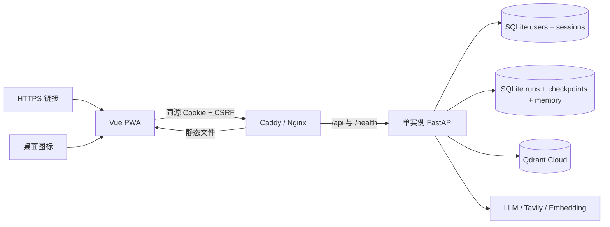

# 单一所有者账户与 PWA 部署设计

日期：2026-09-26

## 1. 背景

当前项目是本地、单实例应用：Vue/Vite 前端访问 FastAPI，研究运行、LangGraph checkpoint 和研究记忆保存在 SQLite，文献检索单元保存在 Qdrant。系统没有账户、授权和数据租户边界，README 也明确将用户账户、云部署和自动发布列为未实现能力。

本次目标不是建设完整多用户平台，而是让项目具备以下使用方式：

1. 用户可以通过 HTTPS 链接访问。
2. 用户可以把网页安装成桌面 PWA，从系统图标启动。
3. 首次访问时创建唯一的所有者账户，之后通过登录进入系统。
4. 未登录请求不能读取或修改研究、记忆和 RAG 数据。
5. 保留当前单实例、SQLite、LangGraph 和 Qdrant 架构。

## 2. 范围

### 2.1 本期包含

- 单一所有者注册、登录、退出和会话恢复。
- 所有业务 API 的统一认证保护。
- Cookie 会话、CSRF 校验、密码哈希和登录限流。
- 前端首次设置页、登录页、认证门禁和退出入口。
- PWA manifest、图标、Service Worker 和安装入口。
- 单服务器 Docker 部署、HTTPS、反向代理和持久化卷。
- 已有 SQLite 与 Qdrant 数据继续由唯一所有者使用。

### 2.2 本期不包含

- 多用户同时使用、角色和权限系统。
- 给研究档案、checkpoint 或 Qdrant payload 增加 `user_id`。
- 邮箱验证、短信、第三方 OAuth、邀请系统和管理员后台。
- 在线邮件找回密码。
- 计费、套餐和用量结算。
- 多个 FastAPI 实例或横向扩展。
- 原生 Electron 或 Tauri 安装包。

## 3. 参考项目结论

[DataNex-Invest](https://github.com/heranxin/DataNex-Invest) 使用 Flask、SQLAlchemy 和 SQLite 实现用户表，通过 Werkzeug PBKDF2 哈希密码，并把 `user_id` 和用户名写入 Flask Session。注册、登录和退出流程集中在 [`app.py`](https://github.com/heranxin/DataNex-Invest/blob/main/app.py)。

可以参考它的首次注册、登录后进入工作台和本地 SQLite 用户表流程，但不直接复制下列实现：

- `SECRET_KEY` 写死在源码。
- 各路由手动判断 Session，容易漏掉接口。
- 注册默认长期开放。
- 会话缺少服务端撤销、统一到期和 CSRF 约束。
- 部分业务页面没有一致的认证边界。

本项目采用 FastAPI 统一依赖或中间件保护业务接口，并使用服务器端会话记录。

## 4. 总体架构



生产环境只暴露一个域名。前端静态资源、认证 API、研究 SSE、RAG 上传和健康检查全部走同一来源，避免跨域 Cookie 和 SSE 配置分叉。

FastAPI 保持一个进程实例。现有 EventPublisher 在进程内保存 SSE 订阅者，SQLite 也不适合多个独立实例并发扩展。

## 5. 账户模式

### 5.1 首次设置

- `users` 表为空时，`GET /api/v1/auth/status` 返回 `registration_open=true`。
- 前端显示“创建所有者账户”。
- 注册事务写入唯一 `owner` 用户。
- `role` 字段使用唯一约束，数据库层保证最多只有一个所有者。
- 创建成功后立即创建登录会话。
- 已存在所有者时，再次注册返回 `403 registration_closed`。

这种方式避免开放注册，也避免在现阶段给全部业务数据增加租户字段。

### 5.2 登录

- 使用用户名和密码，不要求邮箱服务。
- 登录成功创建 256 位随机会话令牌。
- 浏览器 Cookie 保存原始令牌；SQLite 只保存令牌的 SHA-256 哈希。
- 会话固定有效期为 7 天；每次登录创建新会话。
- 退出时删除服务器会话并清除 Cookie。
- 错误信息统一为“用户名或密码错误”，不区分账号是否存在。

### 5.3 密码

新密码使用 Argon2id 哈希，参数至少满足 OWASP Password Storage Cheat Sheet 的建议。密码要求：

- 长度 12 到 128 个字符。
- 不要求强制大小写、数字和特殊字符组合。
- 不在日志、SSE、错误详情或数据库明文字段中出现。

参考：[OWASP Password Storage Cheat Sheet](https://cheatsheetseries.owasp.org/cheatsheets/Password_Storage_Cheat_Sheet.html)。

## 6. 数据结构

用户与会话继续存入现有 SQLite 文件，新增两张业务表：

```sql
CREATE TABLE users (
    user_id TEXT PRIMARY KEY,
    username TEXT NOT NULL UNIQUE,
    password_hash TEXT NOT NULL,
    role TEXT NOT NULL UNIQUE CHECK (role = 'owner'),
    created_at TEXT NOT NULL,
    password_changed_at TEXT NOT NULL
);

CREATE TABLE auth_sessions (
    token_hash TEXT PRIMARY KEY,
    user_id TEXT NOT NULL REFERENCES users(user_id) ON DELETE CASCADE,
    csrf_token TEXT NOT NULL,
    created_at TEXT NOT NULL,
    expires_at TEXT NOT NULL,
    last_seen_at TEXT NOT NULL
);

CREATE INDEX idx_auth_sessions_user_expiry
ON auth_sessions(user_id, expires_at);
```

SQLite 必须启用外键约束。注册使用显式事务，唯一 `role` 约束负责处理并发首次注册。

现有 `research_runs`、checkpoint、memory 和 Qdrant collection 不改变。登录后的唯一所有者可看到已有本地数据。

## 7. API 设计

### 7.1 公共接口

| 方法 | 路径 | 作用 |
| --- | --- | --- |
| `GET` | `/health` | 启动健康检查 |
| `GET` | `/api/v1/auth/status` | 返回是否允许首次注册、是否已登录 |
| `POST` | `/api/v1/auth/register` | 仅创建第一个所有者 |
| `POST` | `/api/v1/auth/login` | 创建会话 |

### 7.2 登录接口

| 方法 | 路径 | 作用 |
| --- | --- | --- |
| `GET` | `/api/v1/auth/me` | 返回当前所有者及 CSRF token |
| `POST` | `/api/v1/auth/logout` | 删除当前会话 |

### 7.3 认证保护

以下路由全部要求有效会话：

- `/api/v1/research/**`
- `/api/v1/memories/**`
- `/api/v1/literature/**`

FastAPI 使用统一 `require_owner` 依赖或认证中间件读取 Cookie、哈希令牌、查询会话并检查到期时间。未登录统一返回 `401`，不重定向 HTML 页面。

状态修改请求还必须携带 `X-CSRF-Token`。服务器将其与当前会话的 CSRF token 做恒定时间比较。研究 SSE 使用现有 `fetch` POST，请求会正常携带同源 Cookie 和 CSRF header。

## 8. Cookie 与会话安全

生产 Cookie：

```text
Name: __Host-research_session
Secure: true
HttpOnly: true
SameSite: Lax
Path: /
Max-Age: 604800
```

本地 HTTP 开发使用独立 Cookie 名称并允许 `Secure=false`，生产配置必须设置 `AUTH_COOKIE_SECURE=true`。生产环境只允许 HTTPS。

Cookie 中只保存随机会话令牌，不保存用户名、密码、角色或用户资料。参考：[OWASP Session Management Cheat Sheet](https://cheatsheetseries.owasp.org/cheatsheets/Session_Management_Cheat_Sheet.html)。

登录接口按 IP 和用户名组合限流，初始规则为 15 分钟内最多 5 次失败。成功登录清除对应失败计数。单实例首版可以使用进程内限流器。

## 9. 前端流程

现有 `RootApp` 已负责等待后端健康检查。认证门禁接在健康检查之后：

```text
等待后端
  → GET /auth/status
      → registration_open：显示首次设置页
      → 未登录：显示登录页
      → 已登录：挂载现有 App
```

新增：

- `AuthGate.vue`：负责认证状态和页面切换。
- `OwnerSetup.vue`：用户名、密码、重复密码。
- `LoginForm.vue`：用户名和密码。
- `auth.ts`：认证 API 和内存状态。
- 顶部退出按钮。
- 统一 API 请求封装，自动携带 Cookie 和 CSRF header。

现有 research、memory 和 literature API 客户端迁移到统一请求封装，避免某个接口漏传认证信息。401 响应清除前端认证状态并返回登录页。

前端不把会话令牌存入 `localStorage`、`sessionStorage` 或 Vue 状态。

## 10. PWA 与桌面图标

使用 `vite-plugin-pwa` 生成 manifest 与 Service Worker。manifest 至少包含：

- `name` 和 `short_name`
- 192×192、512×512 图标
- maskable 图标
- `start_url: /`
- `scope: /`
- `display: standalone`
- `theme_color` 和 `background_color`

Service Worker 只缓存版本化静态资源和离线说明页。以下路径必须使用网络，不进入运行时缓存：

- `/api/**`
- `/health`
- 研究 SSE
- 文献上传与回答

前端提供“安装到桌面”入口；浏览器不支持安装事件时隐藏该按钮。安装后点击系统图标仍然打开同一个 HTTPS 应用。

PWA manifest 的作用和安装字段参考：[web.dev Web App Manifest](https://web.dev/learn/pwa/web-app-manifest)。

## 11. 部署设计

第一版部署到一台 Linux 云服务器，使用 Docker Compose：

```text
services:
  web:
    Vue production build + Caddy/Nginx
  api:
    FastAPI，单 worker

external:
  Qdrant Cloud
  LLM、Tavily、DashScope

volumes:
  SQLite 数据目录
  Hugging Face / Docling 模型缓存
```

反向代理规则：

```text
/          -> Vue 静态文件
/api/*     -> FastAPI:8000
/health    -> FastAPI:8000
```

必须关闭代理对 SSE 的响应缓冲，并为研究流配置足够长的读取超时。上传大小限制同时在反向代理与 FastAPI 中设置。

生产环境变量至少包括：

```text
APP_BASE_URL=https://research.example.com
AUTH_COOKIE_SECURE=true
AUTH_SESSION_DAYS=7
AUTH_LOGIN_ATTEMPTS=5
AUTH_LOGIN_WINDOW_SECONDS=900
CHECKPOINT_DB_PATH=/app/data/checkpoints.sqlite
```

API 密钥继续由服务器 `.env` 或部署平台 Secret 注入，永远不进入前端构建。

## 12. 账户恢复

本期不接邮件服务。提供仅服务器管理员可运行的 CLI：

```text
python -m deep_research.auth reset-password
```

CLI 在服务器终端读取新密码，不通过命令行参数传递密码，并使全部旧会话失效。它不能通过 HTTP 调用。

## 13. 迁移与回滚

### 13.1 迁移

1. 备份 SQLite 文件。
2. 创建 `users` 和 `auth_sessions` 表。
3. 启动服务后首次访问进入所有者注册。
4. 注册完成后，原有研究历史和 RAG 文献继续可见。
5. 验证登录、SSE、文献上传、历史读取与退出。

### 13.2 回滚

认证表与现有研究表独立。出现问题时可回滚应用版本并保留新增表；原有研究和 Qdrant 数据不需要转换或删除。

## 14. 测试与验收

### 14.1 后端测试

- 只有第一个注册请求成功；后续注册返回 403。
- 密码只以 Argon2id 哈希保存。
- 登录创建服务器会话和正确 Cookie 属性。
- 错误密码、到期会话和已退出会话返回 401。
- POST/DELETE 缺少或使用错误 CSRF token 时返回 403。
- `/health` 和认证入口保持公开。
- research、memory、literature 的全部路由均受保护。
- 登录后的研究 SSE、恢复和取消流程保持可用。

### 14.2 前端测试

- 后端就绪后按认证状态显示设置页、登录页或主应用。
- 401 自动返回登录页。
- API 客户端发送 Cookie 和 CSRF header。
- 登出后研究和文献组件卸载。
- PWA manifest 内容与图标路径有效。
- Service Worker 不缓存 API、SSE 和上传请求。

### 14.3 部署验收

- 新浏览器首次访问可创建所有者并登录。
- 已安装 PWA 可从桌面图标启动。
- HTTPS、Cookie 和 CSRF 行为符合生产配置。
- 容器重启后账户、研究历史和文献仍存在。
- 长时间研究 SSE 不被反向代理中断或缓冲。
- 未登录用户无法读取任何研究、记忆或文献数据。

## 15. 未来多用户扩展边界

以后开放多用户时必须单独设计和迁移：

- 给 run、thread、archive、memory card 增加 `owner_user_id`。
- 给 Qdrant payload 增加 `owner_user_id`，所有查询和删除强制过滤。
- 给 checkpoint 的 thread 标识建立用户归属关系。
- 增加配额、邀请、邮箱验证、审计和管理员能力。

在这些隔离完成前，注册接口始终只允许唯一所有者。